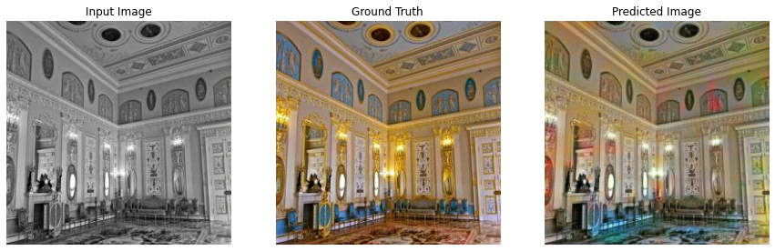
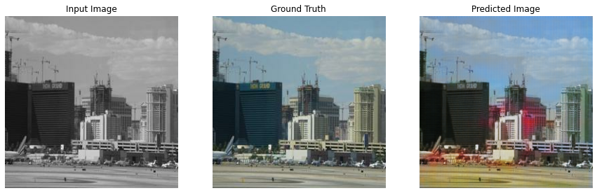
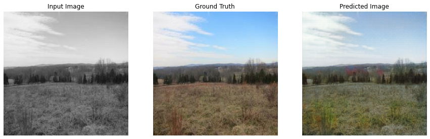
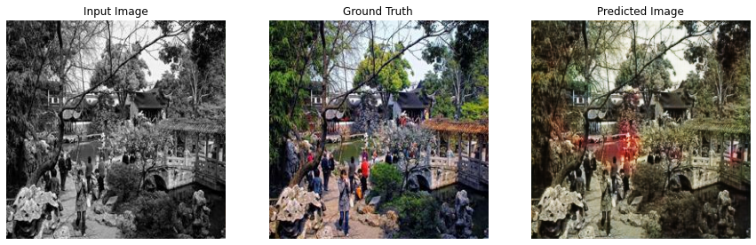
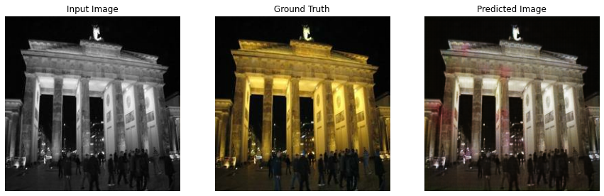
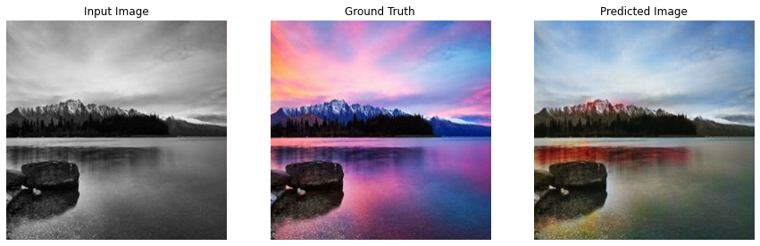
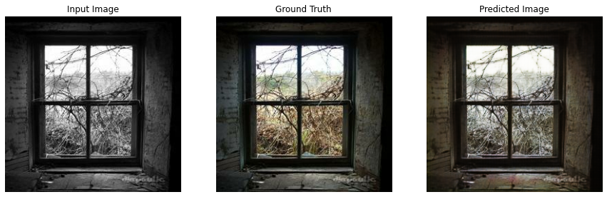
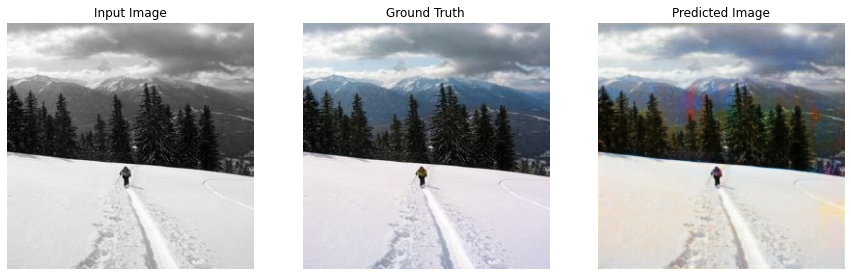
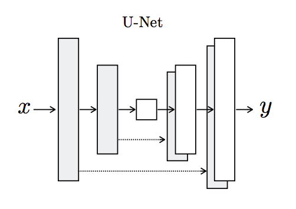
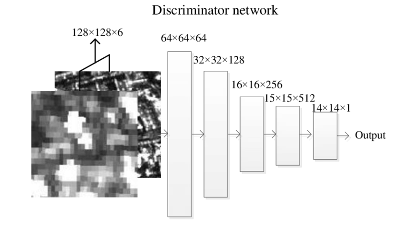

# GAN-Workshop
[](http://hits.dwyl.io/adriacabeza/GAN-workshop)
[](https://github.com/adriacabeza/GAN-workshop)
[](https://GitHub.com/adriacabeza/GAN-workshop/stargazers/)
[](https://github.com/adriacabeza/GAN-workshop)
[](https://www.python.org/)
[](https://colab.research.google.com/github/adriacabeza/GAN-workshop/)

Introducción a las Redes Generativas Adversarias :robot:. Además de su explicación, el repositorio contiene un proyecto, hecho en dos días así que no es perfecto, que coloriza imágenes en blanco y negro usando una conditional GAN. 


## Charla: Introducción a las Redes Generativas Adversarias
El contenido más teórico de la charla está disponible en las [slides](slides/slides.pdf).

## Proyecto: Autocolorizador
### Prerequisites
- Para instalar los requerimientos, usa el requirements.txt (vas a necesitarlos para preparar el dataset).
```bash
pip install -r requirements.txt
```

### Resultados
Aquí podemos ver algunos resultados obtenidos (hand-picked) tras un día de training en un dataset de 36.500 imágenes: 

| Results |
|--------|
|      |
|       |
|       |
|       |
|       |
|       |
|       |
|       |
|       |
|       |
|       |

Además puedes descargarte los weights del generador por si quéreis hacer pruebas: **[generador](./weights/generator.h5)**.


### Arquitectura
Este código está basado en la arquitectura **pix2pix** (por *Isola et al*). Pese a disponer de un generador y un discriminador con objetivos opuestos en busca de un equilibrio de Nash, esta arquitectura es diferente a las GANs normales pues está no coge como input ruido aleatorio (espacio latente),  en esta en cambio cogemos como input toda una imagen *x*. Nuestro objetivo es **traducirla** en otra imagen con una estructura similar. Es decir, nuestro generador *G* tiene que producir *G(X)* el cual tendrá que ser indistinguible de *y* (la otra imagen con una estructura similar) para nuestro discriminador *D*.


Sus partes principales son:

- **Generador U-NET**: el generador de la pix2pix se parece mucho a un **autoencoder**. Coge la imagen que tiene que ser traducida, la comprime a un espacio de menos dimensiones llamado **Cuello de Botella** y luego aprende a hacer upsampling para conseguir la imagen deseada como output. 

  Además también tiene ciertos parecidos con una ResNet en la manera en como la información de capas previas es introducida a las siguientes usando las llamadas **skip connections**. En esta arquitectura disponemos de skip connections que salen de la mitad encoder de la red y van a la otra mitad decoder. Esto nos sirve para prevenir que perdamos información en el cuello de botella.

<p align="center">
  
</p>

- **Discriminador Patch-GAN**: en este discriminador en vez de coger las imágenes y clasificarlas en verdaderas o falsas, se clasifican individualmente diferentes trozos de la imagen así se refuerza el objetivo de conseguir detalles mucho más nítidos. Además es más rápido de clasificar toda una imagen ya que solo tiene que clasificar pequeños trozos y eso significa menos parámetros.

<p align="center">
  
</p>


### Dataset
Como dataset se ha usado un subset de [Places365](http://places2.csail.mit.edu/download.html) de 1GB aproximadamente (podría haber usado uno más grande pero la combinació: internet de pueblo + confinamiento, no es muy buena).

Para preparar el dataset para el notebook, necesitamos que cada par de imágenes (blanco y negro y colorida) esten combinadas en la misma imágen (mitad y mitad). Para hacerlo primero hay que descargarse las imágenes a color y luego usar los siguientes scripts disponibles en la carpeta dataset:
```
python3 create_grayscale.py --original ../data/original --grayscale ../data/gray_scale
python3 combine_images.py --original ../data/original --grayscale ../data/gray_scale
```

Esto os creará una carpeta con el dataset preparado.


